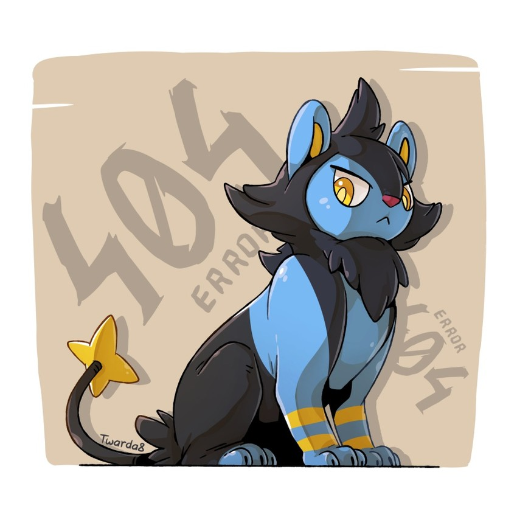

### Mini Project: PokeAPI Integration Project

In this PokeAPI Integration project, you'll develop a web application that seamlessly integrates with the PokeAPI, providing users with an immersive experience into the world of Pokémon. Leveraging HTML, Bootstrap, CSS, and Asychronous JavaScript, you'll create a dynamic and interactive platform for exploring Pokémon data and information.

#### Project Requirements:

**Homepage:**
Design a visually appealing landing page with Bootstrap components and custom CSS styles.
Implement responsive design principles to ensure compatibility across various devices and screen sizes.

```html
 <link rel="stylesheet" href="style.css" >
    </head>

    <body class="container">
        <header>
            <!-- place navbar here -->
             <h3 class="h3"> Welcome to your pokedex</h3>
        </header>
        <hr>

        <main>
            <div>
                <p class="p1"> Dive into the vibrant world of Pokémon with our comprehensive Pokédex! Whether you're a seasoned Trainer or just starting your journey, our site is your go-to resource for everything Pokémon.

                    Explore detailed profiles of every Pokémon, including their types, abilities, stats, and evolutions.

                </p>
            </div>
            <div class="b3">
                <a href="search.html" class="btn btn-warning">LETS BEGIN</a>
            </div>

        </main>
```

Below is the css code used for the home page:

```css
* {
  margin: 0;
  padding: 0;
  box-sizing: border-box;
  font-family: "Poppins", sans-serif;
}

.container {
  width: 100%;
  min-height: 100vh;
  padding: 5%;
  background-image: linear-gradient(
      rgba(234, 240, 214, 0.9),
      rgba(233, 237, 220, 0.9)
    ), url(images/main_pg_img.jpeg);
  background-position: center;
  background-size: cover;
}

.h3 {
  font-family: Cambria, Cochin, Georgia, Times, "Times New Roman", serif;
  font-weight: bold;
}

.p1 {
  font-style: italic;
}
```

**Pokémon Search Page and Pokémon Details Page:**

_Disclamer:_
To provide a simple yet efficient and effective webpage i have blended the search and deatil page into one. This page can be use to search and gather details about your searched pokemon.

1. Create a search page where users can enter a Pokémon's name or ID to retrieve relevant information.

```html
 <link rel="stylesheet" href="search_style.css">

    </head>

    <body>

        <header>
            <!-- place navbar here -->
            <nav class="navbar">
                <a class="btn btn-warning" href="home.html" > Home </a>
                <!-- <a class="btn btn-dark" href="details.html"> Details </a> -->
            </nav>
        </header>


        <main>
            <div class="container">


                <form class="searchbar">
                    <input type="text" placeholder="Search your Pokemon" name="q" class="search">
                    <button type ="submit"> </button>
                </form>

     <!-- progress spinner goes here -->

                <div class="loading d-none">
                    <!-- progress spinner goes here -->
                </div>


    <!-- pokemon found -->


                <div class="result active">

                    <div class="pokemonfound">


                    </div>

    <!-- pokemon not found -->
        <div class="pokemon_notfound">

        </div>

                </div>

            </div>

        </main>

        <script src="pokedex.js"></script>

```

2. Utilize JavaScript asynchronous functions to fetch data from the PokeAPI and dynamically update the webpage content based on user input.

```js
const form = document.querySelector("form")
const loading = document.querySelector('.loading')
const search = document.querySelector('.search')
const result = document.querySelector('.result')

form.addEventListener('submit', (e) => {
    e.preventDefault();
    loading.classList.remove('d-none')
    loadPokemon();
})


const getPokemon = async (URL, text) => {
    try{

        const res = await fetch(URL);
        if(!res.ok || !text || text <= 0 || text >=1000){
            throw 'Invalid entry. Please enter number from 1 to 1000 OR type correct name.'
        }
        const data = await res.json()
        console.log(data)


        const{id, height, abilities, types, stats, name, sprites:{other:{dream_world:{front_default}}}} = data;

        loading.classList.add('d-none');
        result.className = 'result active'
        result.innerHTML = `
        <div class="pokemon found">
        <span class="closebox"></span>
        
        <h3 class="pokename"> Name: ${name} </h3>
        <p class ="pokenumber">ID#: ${id.toString().padStart(4,'0')}</p>
        <p class ="height"> Height: ${height} ft</p>
        <p class ="pokeability"> Abilities: ${abilities[0].ability.name} and ${abilities[1].ability.name}</p>
        <p class ="poketype"> Type: ${types[0].type.name}</p>
        <h5 class="pokestat">Stats:</h5>
        <p class ="pokestatus">${stats[0].stat.name}: ${stats[0].base_stat}</p>
        <p class ="pokestatus">${stats[1].stat.name}: ${stats[1].base_stat}</p>
        <p class ="pokestatus">${stats[2].stat.name}: ${stats[2].base_stat}</p>
        <p class ="pokestatus">${stats[5].stat.name}: ${stats[5].base_stat}</p>
        </div>
        `;
        search.value = null;

    } catch(error){
        console.log(error)


        loading.classList.add('d-none');
        result.className = 'result active'
        let pokemonid = search.value ? (isNaN(search.value) ? search.value: `ID# ${search.value}`): " ";
        result.innerHTML = `
        
        <div class="pokemon_notfound">
        <span class="closebox"></span>
        
        <p class="error">Pokemon <span class="pokemon">${pokemonid}</span> Not Found, Please try again. </p>

        </div>
        `;

        search.value = null;

    }
}

function loadPokemon(){
    let text = search.value.trim();
    if(isNaN(text)) text = text.toLowerCase();
    const URL = `https://pokeapi.co/api/v2/pokemon/${text}`;
    getPokemon(URL, text);
}

```
3. Develop a details page that displays comprehensive information about a specific Pokémon, including its abilities, types, stats, and image.
```html
 <link rel="stylesheet" href="search_style.css">

    </head>

    <body>

        <header>
            <!-- place navbar here -->
            <nav class="navbar">
                <a class="btn btn-warning" href="home.html" > Home </a>
                <!-- <a class="btn btn-dark" href="details.html"> Details </a> -->
            </nav>
        </header>


        <main>
            <div class="container">
       

                <form class="searchbar">
                    <input type="text" placeholder="Search your Pokemon" name="q" class="search">
                    <button type ="submit"> </button>
                </form>
        
     <!-- progress spinner goes here -->
    
                <div class="loading d-none">
                    <!-- progress spinner goes here -->
                </div>
    
    
    
    <!-- pokemon found -->
    
    
                <div class="result active">
                
                    <div class="pokemonfound">
    
                        
                         
                    </div>
    
    <!-- pokemon not found -->
        <div class="pokemon_notfound">
    
        </div>
    
                </div>
        
            </div>
    
        </main>

        <script src="pokedex.js"></script>
```
